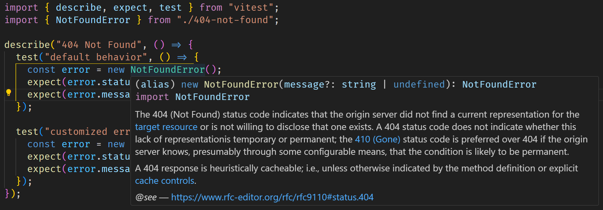

# @mrcaidev/http-errors

Utility classes for HTTP errors.

## 📦 Installation

```sh
npm add @mrcaidev/http-errors # using npm
yarn add @mrcaidev/http-errors # using yarn
pnpm add @mrcaidev/http-errors # using pnpm
```

## 🚀 Usage

Simplest:

```ts
import { BadRequestError } from "@mrcaidev/http-errors";

throw new BadRequestError(); // status: 400, message: "Bad Request"
```

Custom error message:

```ts
import { BadRequestError } from "@mrcaidev/http-errors";

throw new BadRequestError("Malformed data"); // status: 400, message: "Malformed data"
```

Dynamic status code:

```ts
import { HttpError } from "@mrcaidev/http-errors";

throw new HttpError(400); // status: 400, message: "Bad Request"
```

Dynamic status code and custom error message:

```ts
import { HttpError } from "@mrcaidev/http-errors";

throw new HttpError(400, "Malformed data"); // status: 400, message: "Malformed data"
```

Every error class extends `HttpError`, which further extends `Error`.

```ts
import { BadRequestError, HttpError } from "@mrcaidev/http-errors";

new BadRequestError() instanceof HttpError; // true
new HttpError(400) instanceof Error; // true
```

Hover over an error class in the editor to see its definition in RFC.



## 🔎 References

- [RFC 9110](https://www.rfc-editor.org/rfc/rfc9110)
- [RFC 8470](https://www.rfc-editor.org/rfc/rfc8470)
- [RFC 7725](https://www.rfc-editor.org/rfc/rfc7725)
- [RFC 6585](https://www.rfc-editor.org/rfc/rfc6585)
- [RFC 5842](https://www.rfc-editor.org/rfc/rfc5842)
- [RFC 4918](https://www.rfc-editor.org/rfc/rfc4918)
- [RFC 2774](https://www.rfc-editor.org/rfc/rfc2774)
- [RFC 2295](https://www.rfc-editor.org/rfc/rfc2295)

## 📜 License

[MIT](LICENSE)
