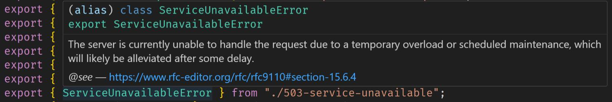

# @mrcaidev/http-errors

Utility classes for HTTP errors.

## 📦 Installation

```sh
npm i @mrcaidev/http-errors
```

## 🛠️ Usage

Standard:

```ts
import { BadRequestError } from "@mrcaidev/http-errors";

throw new BadRequestError("Invalid data format");
```

Customization:

```ts
import { HttpError } from "@mrcaidev/http-errors";

throw new HttpError(400, "Invalid data format");
```

Hover over the error class to see its definition and the link to its RFC.



## 🔎 References

- [RFC 9110](https://www.rfc-editor.org/rfc/rfc9110)
- [RFC 8470](https://www.rfc-editor.org/rfc/rfc8470)
- [RFC 7725](https://www.rfc-editor.org/rfc/rfc7725)
- [RFC 6585](https://www.rfc-editor.org/rfc/rfc6585)
- [RFC 5842](https://www.rfc-editor.org/rfc/rfc5842)
- [RFC 4918](https://www.rfc-editor.org/rfc/rfc4918)
- [RFC 2774](https://www.rfc-editor.org/rfc/rfc2774)
- [RFC 2295](https://www.rfc-editor.org/rfc/rfc2295)

## 📜 License

[MIT](LICENSE)
